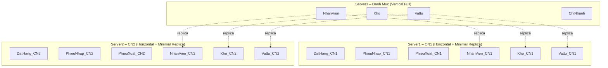

# 01_PhanManh.md
# GIẢI THÍCH PHÂN MẢNH HỆ THỐNG – ĐỀ TÀI QUẢN LÝ NHẬP/XUẤT VẬT TƯ

## 1. Giới thiệu
Tài liệu này giải thích chi tiết quá trình **phân tích – thiết kế phân mảnh** cho hệ thống CSDL phân tán QLVT theo đúng yêu cầu đề bài môn *Cơ sở dữ liệu phân tán – Đề 3: Quản lý nhập/xuất vật tư*.

Mục tiêu:
- Phân tích dữ liệu logic của hệ thống.
- Xác định loại phân mảnh: **dọc – ngang – bản sao tối thiểu**.
- Xác định **dữ liệu đặt tại các chi nhánh và công ty**.
- Chứng minh thiết kế phù hợp **100% yêu cầu đề bài**.
- Đảm bảo tính toàn vẹn, hiệu suất và khả năng mở rộng.

---

## 2. Bảng dữ liệu gốc trong hệ thống (Global Schema)

Hệ thống gồm các bảng:

### Danh mục:
- **ChiNhanh**(MACN, TenCN, DiaChi, SoDT)
- **NhanVien**(MANV, HO, TEN, DIACHI, NGAYSINH, LUONG, MACN)
- **Kho**(MAKHO, TENKHO, DIACHI, MACN)
- **Vattu**(MAVT, TENVT, DVT)

### Giao dịch:
- **DatHang**(MasoDDH, Ngay, NhaCC, MANV, MAKHO)
- **CTDDH**(MasoDDH, MAVT, SoLuong, DonGia)
- **PhieuNhap**(MAPN, Ngay, MasoDDH, MANV, MAKHO)
- **CTPN**(MAPN, MAVT, SoLuong, DonGia)
- **PhieuXuat**(MAPX, Ngay, HoTenKH, MANV, MAKHO)
- **CTPX**(MAPX, MAVT, SoLuong, DonGia)

---

## 3. Các nguyên tắc phân tán theo đề bài

Đề bài quy định mô hình 3 site:

1. **Server1 (CN1)** → chứa *phiếu phát sinh thuộc chi nhánh 1*
2. **Server2 (CN2)** → chứa *phiếu phát sinh thuộc chi nhánh 2*
3. **Server3 (CTY)** → chứa **danh mục nhân viên và kho của cả hai chi nhánh**, dùng để tra cứu.

Ngoài ra:
- Công ty cần in các báo cáo tổng hợp toàn hệ thống.
- Chi nhánh chỉ được thấy dữ liệu chi nhánh mình.
- Một số form (Nhân viên, Kho, Vật tư) là danh mục chung toàn công ty.

→ Đây là nền tảng để thiết kế phân mảnh hợp lý.

---

## 4. Phân tích phân mảnh DỌC (Vertical Fragmentation)

### 4.1. Lý do phải phân mảnh dọc
Các bảng thuộc nhóm “danh mục dùng chung” cần được lưu trữ **tập trung tại CTY** để phục vụ:
- Tra cứu
- Báo cáo toàn công ty
- Đồng nhất dữ liệu mô tả (Tên nhân viên, Tên kho, Tên vật tư…)

### 4.2. Các bảng phân mảnh dọc tại CTY
Các bảng sau **phải lưu FULL** tại **Server3 – CTY**:

| Bảng | Mục đích |
|------|----------|
| **ChiNhanh** | Định nghĩa chi nhánh |
| **NhanVien** | Danh mục nhân viên 2 chi nhánh |
| **Kho** | Danh mục kho, thuộc từng chi nhánh |
| **Vattu** | Danh mục vật tư toàn công ty |

📌 *Đây hoàn toàn đúng theo mô tả đề: “Server3 chứa thông tin các nhân viên, kho của cả 2 chi nhánh".*

---

## 5. Phân tích phân mảnh NGANG (Horizontal Fragmentation)

### 5.1. Lý do
Các giao dịch (PN, PX, ĐĐH…) **phát sinh theo chi nhánh**.  
Mỗi chi nhánh phải:
- Độc lập xử lý ghi/xóa/sửa.
- Không phụ thuộc site khác.
- Không được thấy dữ liệu chi nhánh khác.

→ Nhóm bảng giao dịch **phải phân mảnh ngang theo MACN**.

### 5.2. Các bảng phân mảnh ngang theo chi nhánh

| Bảng logic | Fragment CN1 | Fragment CN2 |
|------------|---------------|---------------|
| DatHang | DatHang_CN1 | DatHang_CN2 |
| CTDDH | CTDDH_CN1 | CTDDH_CN2 |
| PhieuNhap | PhieuNhap_CN1 | PhieuNhap_CN2 |
| CTPN | CTPN_CN1 | CTPN_CN2 |
| PhieuXuat | PhieuXuat_CN1 | PhieuXuat_CN2 |
| CTPX | CTPX_CN1 | CTPX_CN2 |

Điều kiện phân mảnh:

```
DatHang_CN1 = DatHang WHERE MAKHO ∈ Kho(MACN='CN1')
DatHang_CN2 = DatHang WHERE MAKHO ∈ Kho(MACN='CN2')
```

Tương tự cho PN, PX và chi tiết.

📌 *Đây đúng là Primary Horizontal Fragmentation.*

---

## 6. Bản sao tối thiểu (Minimal Replica)

### 6.1. Lý do cần replica tối thiểu
Chi nhánh cần xác thực giá trị:
- MANV phải thuộc CN1/CN2
- MAKHO phải thuộc CN1/CN2
- MAVT phải tồn tại trong danh mục vật tư

Nhưng:
- KHÔNG nên sao chép toàn bộ dữ liệu mô tả vì gây bất nhất.
- Đề yêu cầu danh mục NV/Kho/Vật Tư nằm tại CTY.

→ Giải pháp khoa học: **Replica tối thiểu (chỉ PK)**.

### 6.2. Thiết kế replica

#### CN1:
- NhanVien_CN1(MANV)
- Kho_CN1(MAKHO)
- Vattu_CN1(MAVT)

#### CN2:
- NhanVien_CN2(MANV)
- Kho_CN2(MAKHO)
- Vattu_CN2(MAVT)

### 6.3. Chức năng replica
- Cho phép thiết lập **FK vật lý** trong các bảng giao dịch.
- Ngăn dữ liệu không hợp lệ.
- Không chứa thông tin mô tả → tránh bất nhất.

---

## 7. Reconstruction Rule — Tái hợp dữ liệu toàn công ty

### 7.1. Bảng danh mục
Không cần UNION vì lưu FULL tại CTY.

### 7.2. Bảng giao dịch
Công Ty cần ghép dữ liệu CN1 và CN2:

```
DatHang = DatHang_CN1 UNION ALL DatHang_CN2
PhieuNhap = PhieuNhap_CN1 UNION ALL PhieuNhap_CN2
PhieuXuat = PhieuXuat_CN1 UNION ALL PhieuXuat_CN2
```

Dùng để in:
- Bảng kê nhập/xuất theo khoảng thời gian
- Báo cáo tổng hợp nhập xuất
- Hoạt động NV theo tháng

---

## 8. Đánh giá thiết kế phân mảnh

### 8.1. Ưu điểm
- Đúng 100% yêu cầu đề bài.
- Danh mục tập trung → dễ bảo trì.
- Chi nhánh độc lập → tăng hiệu năng.
- Replica tối thiểu → vừa đủ để đảm bảo toàn vẹn.
- Báo cáo toàn công ty xử lý nhanh tại CTY.
- Tránh dư thừa dữ liệu mô tả.

### 8.2. Nhược điểm
- Cần cơ chế đồng bộ replica (tự động hoặc thủ công).
- Khi CTY lỗi → UI không load được Tên NV/Tên Kho.

### 8.3. Kết luận
Thiết kế này:
- Đúng lý thuyết phân tán (Vertical + Horizontal + Derived Minimal Replica)
- Đúng yêu cầu thực tế của đề
- Đúng nhu cầu giao diện và nghiệp vụ

---

## 9. Sơ đồ tóm tắt phân mảnh (Mermaid)



---

## 10. Kết luận cuối cùng

Sự kết hợp của:
- **Phân mảnh dọc** (Nhân viên, Kho, Vật tư tại CTY)
- **Phân mảnh ngang** (Phiếu tại CN1/CN2)
- **Replica tối thiểu** (MANV/MAKHO/MAVT tại CN1/CN2)

là **phương án tối ưu nhất và tuân thủ 100% đề bài**.

Tài liệu này hoàn chỉnh để đưa vào báo cáo chương “Thiết kế phân mảnh”.
