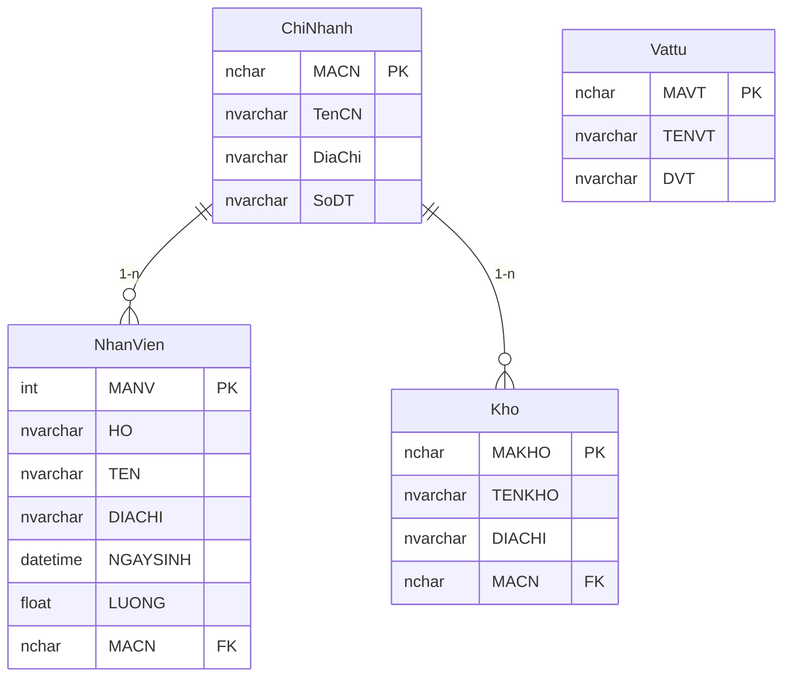
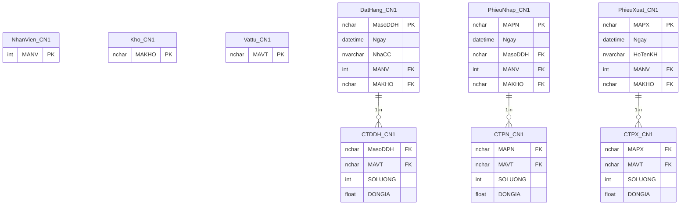
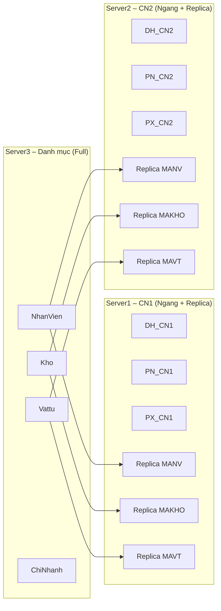

# 02_ERD_3_Site.md
# ERD CHI TIẾT 3 SITE – CSDL PHÂN TÁN QLVT

Tài liệu này mô tả **đầy đủ ERD** cho cả 3 site theo đúng phân mảnh:

- **Server3 – CTY**: danh mục dùng chung (phân mảnh dọc, full attributes)
- **Server1 – CN1**: giao dịch CN1 (phân mảnh ngang), bản sao tối thiểu
- **Server2 – CN2**: giao dịch CN2 (phân mảnh ngang), bản sao tối thiểu

Sơ đồ dùng Mermaid (chuẩn Markdown), phù hợp nộp báo cáo.

---

# 1. ERD SERVER3 – CTY (Danh mục đầy đủ)

Server3 chứa thông tin **NV, Kho, VT, ChiNhanh** theo đúng yêu cầu đề bài:
- CTY phải chứa toàn bộ danh mục để phục vụ tra cứu & báo cáo.
- Đây là **phân mảnh dọc** của hệ thống.

---

# 2. ERD SERVER1 – CN1 (Giao dịch CN1 + Replica tối thiểu)

Server1 chứa:
- Các bảng giao dịch phát sinh bởi CN1 (**phân mảnh ngang**)
- Các bảng replica tối thiểu: chỉ lưu MANV / MAKHO / MAVT (**derived minimal replicas**)

---

# 3. ERD SERVER2 – CN2 (Giao dịch CN2 + Replica tối thiểu)

Cấu trúc **tương tự CN1**, nhưng chứa dữ liệu CN2.

---

# 4. Sơ đồ so sánh 3 site

---

# 5. Kết luận

ERD 3 site đã được phân tách rõ ràng:

| Site | Bảng | Loại phân mảnh |
|------|------|----------------|
| **CTY** | Danh mục NV, Kho, VT, CN | Dọc – Full |
| **CN1** | PN, PX, ĐĐH CN1 | Ngang – CN1 |
| **CN2** | PN, PX, ĐĐH CN2 | Ngang – CN2 |
| **CN1/CN2** | NhanVien_CNx, Kho_CNx, Vattu_CNx | Replica tối thiểu |

Thiết kế đáp ứng:
- Đúng yêu cầu đề bài
- Dữ liệu nhất quán
- Tối ưu cho UI
- Phân quyền và báo cáo toàn công ty

---

*File này đã hoàn chỉnh, sẵn sàng nộp báo cáo.*

