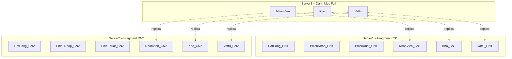

# 03_Fragmentation_Schema.md
# FRAGMENTATION SCHEMA – CSDL PHÂN TÁN QLVT
## (Mô tả đầy đủ quy tắc phân mảnh – đúng chuẩn báo cáo môn CSDL phân tán)

Tài liệu này mô tả **toàn bộ sơ đồ phân mảnh (Fragmentation Schema)** cho hệ thống QLVT theo đúng yêu cầu đề bài Đề 3 – Quản Lý Nhập/Xuất Vật Tư.

Bao gồm:
- Global Conceptual Schema (GCS)
- Fragmentation Schema (FS)
- Allocation Schema (AS)
- Reconstruction Rules
- Data Localization Rules
- Justification (biện minh cho từng loại phân mảnh)

---

# 1. GLOBAL CONCEPTUAL SCHEMA (GCS)
Lược đồ toàn cục của hệ thống gồm các bảng:

## 1.1. Danh mục
- ChiNhanh(MACN, TenCN, DiaChi, SoDT)
- NhanVien(MANV, HO, TEN, DIACHI, NGAYSINH, LUONG, MACN)
- Kho(MAKHO, TENKHO, DIACHI, MACN)
- Vattu(MAVT, TENVT, DVT)

## 1.2. Giao dịch
- DatHang(MasoDDH, Ngay, NhaCC, MANV, MAKHO)
- CTDDH(MasoDDH, MAVT, SoLuong, DonGia)
- PhieuNhap(MAPN, Ngay, MasoDDH, MANV, MAKHO)
- CTPN(MAPN, MAVT, SoLuong, DonGia)
- PhieuXuat(MAPX, Ngay, HoTenKH, MANV, MAKHO)
- CTPX(MAPX, MAVT, SoLuong, DonGia)

---

# 2. PHÂN MẢNH DỌC (VERTICAL FRAGMENTATION)

## 2.1. Các bảng phải phân mảnh dọc
Do yêu cầu đề:
- Server3 (CTY) chứa danh mục để tra cứu và in báo cáo toàn hệ thống.

Các bảng phân mảnh dọc FULL ATTRIBUTES tại CTY:

| Bảng | Lý do |
|------|-------|
| ChiNhanh | Danh mục toàn công ty |
| NhanVien | Hoạt động nhân viên cần truy vấn toàn cục |
| Kho | Dùng cho PN/PX cả công ty |
| Vattu | Dùng cho chi tiết phiếu các chi nhánh |

→ Đây là **vertical full-fragment**, không tách thuộc tính.

---

# 3. PHÂN MẢNH NGANG (HORIZONTAL FRAGMENTATION)

## 3.1. Nguyên tắc
Các giao dịch phát sinh theo chi nhánh.

Đề quy định:
- CN1 lưu phiếu CN1
- CN2 lưu phiếu CN2

## 3.2. Điều kiện phân mảnh

### Fragment CN1:
```
F_DatHang_CN1 = σ_{MAKHO ∈ (Kho where MACN='CN1')}(DatHang)
F_PhieuNhap_CN1 = σ_{MAKHO ∈ (Kho where MACN='CN1')}(PhieuNhap)
F_PhieuXuat_CN1 = σ_{MAKHO ∈ (Kho where MACN='CN1')}(PhieuXuat)
```

### Fragment CN2:
```
F_DatHang_CN2 = σ_{MAKHO ∈ (Kho where MACN='CN2')}(DatHang)
F_PhieuNhap_CN2 = σ_{MAKHO ∈ (Kho where MACN='CN2')}(PhieuNhap)
F_PhieuXuat_CN2 = σ_{MAKHO ∈ (Kho where MACN='CN2')}(PhieuXuat)
```

### CTDDH / CTPN / CTPX (fragment theo cha)
```
CTDDH_CN1 = CTDDH ⋈ DatHang_CN1
CTDDH_CN2 = CTDDH ⋈ DatHang_CN2
CTPN_CN1  = CTPN ⋈ PhieuNhap_CN1
CTPN_CN2  = CTPN ⋈ PhieuNhap_CN2
CTPX_CN1  = CTPX ⋈ PhieuXuat_CN1
CTPX_CN2  = CTPX ⋈ PhieuXuat_CN2
```

→ Đây là **Primary Horizontal Fragmentation**.

---

# 4. BẢN SAO TỐI THIỂU (MINIMAL REPLICA – DERIVED FRAGMENTATION)

Các bảng replica được tạo để:
- Kiểm tra hợp lệ khi lập phiếu
- Dùng làm FK logic
- Không chứa thông tin mô tả → tránh bất nhất

## 4.1. Các bảng replica

### CN1:
- NhanVien_CN1(MANV)
- Kho_CN1(MAKHO)
- Vattu_CN1(MAVT)

### CN2:
- NhanVien_CN2(MANV)
- Kho_CN2(MAKHO)
- Vattu_CN2(MAVT)

→ Đây là **Derived Horizontal Fragmentation + Minimal Vertical Replica**.

---

# 5. ALLOCATION SCHEMA (AS)
Bảng phân bổ dữ liệu vào các site:

| Fragment | Site | Kiểu |
|----------|------|------|
| NhanVien | CTY | Full |
| Kho | CTY | Full |
| Vattu | CTY | Full |
| ChiNhanh | CTY | Full |
| DatHang_CN1 | CN1 | Horizontal |
| DatHang_CN2 | CN2 | Horizontal |
| PhieuNhap_CN1 | CN1 | Horizontal |
| PhieuNhap_CN2 | CN2 | Horizontal |
| PhieuXuat_CN1 | CN1 | Horizontal |
| PhieuXuat_CN2 | CN2 | Horizontal |
| CTDDH_CN1 | CN1 | Horizontal-derived |
| CTDDH_CN2 | CN2 | Horizontal-derived |
| CTPN_CN1 | CN1 | Horizontal-derived |
| CTPN_CN2 | CN2 | Horizontal-derived |
| CTPX_CN1 | CN1 | Horizontal-derived |
| CTPX_CN2 | CN2 | Horizontal-derived |
| NhanVien_CN1 | CN1 | Minimal Replica |
| NhanVien_CN2 | CN2 | Minimal Replica |
| Kho_CN1 | CN1 | Minimal Replica |
| Kho_CN2 | CN2 | Minimal Replica |
| Vattu_CN1 | CN1 | Minimal Replica |
| Vattu_CN2 | CN2 | Minimal Replica |

---

# 6. RECONSTRUCTION RULES

## 6.1. Reconstruction cho danh mục
Không cần tái hợp vì CTY chứa đầy đủ.

## 6.2. Reconstruction cho giao dịch
```
DatHang = DatHang_CN1 UNION ALL DatHang_CN2
PhieuNhap = PhieuNhap_CN1 UNION ALL PhieuNhap_CN2
PhieuXuat = PhieuXuat_CN1 UNION ALL PhieuXuat_CN2
```

## 6.3. Reconstruction CTDDH / CTPN / CTPX
```
CTDDH = CTDDH_CN1 UNION ALL CTDDH_CN2
CTPN  = CTPN_CN1  UNION ALL CTPN_CN2
CTPX  = CTPX_CN1  UNION ALL CTPX_CN2
```

---

# 7. DATA LOCALIZATION RULES

- Mọi truy vấn về danh mục (NV, Kho, VT) → Server CTY.
- Mọi thao tác lập phiếu tại CN → dữ liệu lưu vào bảng CN1/CN2.
- Mọi ràng buộc logic → enforced bằng replica tối thiểu.
- Báo cáo toàn công ty → chạy tại CTY (JOIN + UNION).

---

# 8. JUSTIFICATION – BIỆN MINH THIẾT KẾ

- **Phân mảnh dọc** giúp tập trung danh mục → dễ quản lý, nhất quán.
- **Phân mảnh ngang** phân lập giao dịch → phù hợp mô hình đa chi nhánh.
- **Replica tối thiểu** giảm dư thừa và tránh dữ liệu mô tả bị lệch.
- **Reconstruction rules** đơn giản (UNION ALL).
- Hoàn toàn **phù hợp yêu cầu đề bài** và chuẩn lý thuyết CSDL phân tán.

---

# 9. SƠ ĐỒ TỔNG HỢP (Mermaid)



---

# 10. KẾT LUẬN

Sơ đồ phân mảnh QLVT bao gồm:
- Vertical fragmentation (CTY)
- Horizontal fragmentation (CN1, CN2)
- Minimal replica (CN1/CN2)
- Reconstruction bằng UNION ALL

Thiết kế này đảm bảo:
- Tính đúng đắn
- Tính toàn vẹn
- Hiệu năng
- Đáp ứng 100% yêu cầu đề bài

*File này hoàn chỉnh, sẵn sàng đưa vào báo cáo đồ án.*
