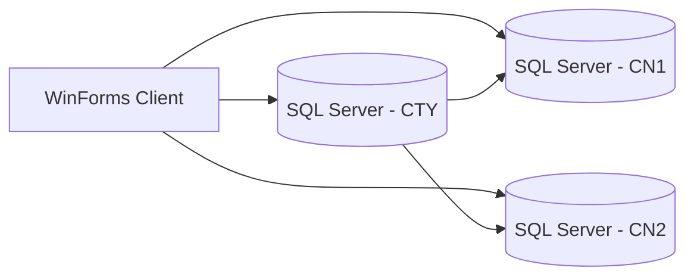
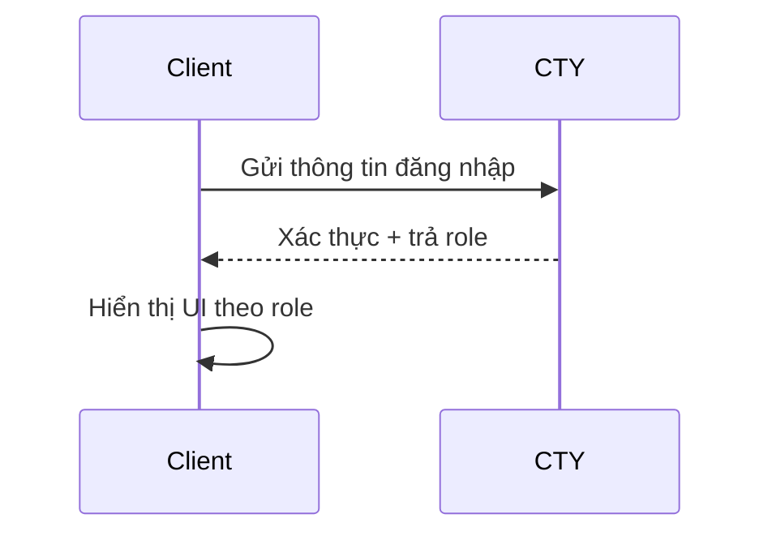
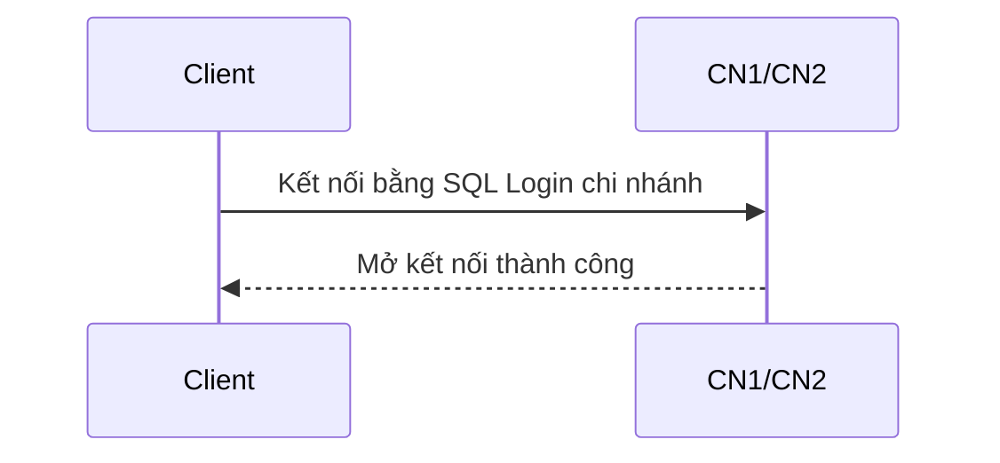
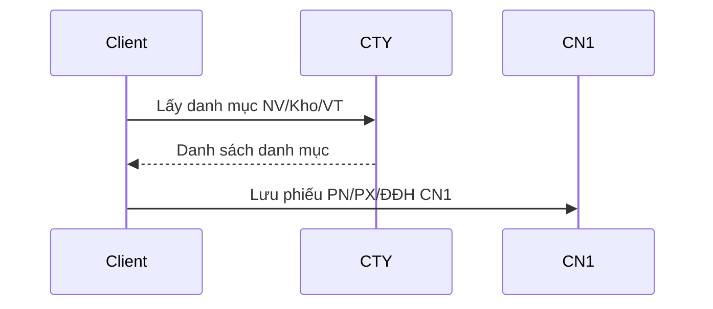
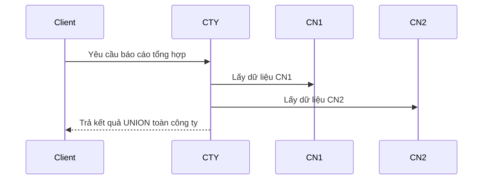
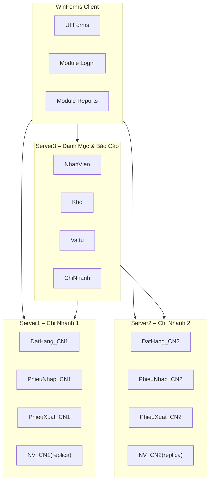

# 04_KienTruc_HeThong.md
# KIẾN TRÚC HỆ THỐNG – CSDL PHÂN TÁN QLVT
## (Tài liệu thiết kế kiến trúc đầy đủ – đúng chuẩn báo cáo đồ án)

Tài liệu này mô tả **kiến trúc tổng thể** của hệ thống Quản Lý Vật Tư phân tán theo mô hình 3 site:
- CN1 (Server1)
- CN2 (Server2)
- CTY (Server3 – trung tâm)

Bao gồm:
- Kiến trúc logic
- Kiến trúc vật lý
- Kiến trúc bảo mật & phân quyền
- Luồng dữ liệu giữa các thành phần
- Kiến trúc các form và cơ chế truy vấn
- Sơ đồ tổng thể bằng Mermaid

---

# 1. KIẾN TRÚC HỆ THỐNG TỔNG QUAN

Hệ thống được xây dựng theo mô hình:

```
WinForms Client  →  CN1/CN2 (giao dịch)  
                →  CTY (danh mục + báo cáo)
```

## 1.1. Các thành phần chính

### (1) **Client – Ứng dụng WinForms**
- Giao diện cho người dùng nhập liệu.
- Chọn chi nhánh -> kết nối đến CN1 hoặc CN2.
- Lấy danh mục từ CTY.
- Gửi lệnh CRUD đến server tương ứng.

### (2) **Server1 – CN1**
- Lưu giao dịch thuộc CN1:
    - DatHang_CN1
    - CTDDH_CN1
    - PhieuNhap_CN1 / CTPN_CN1
    - PhieuXuat_CN1 / CTPX_CN1
- Lưu replica tối thiểu: NhanVien_CN1, Kho_CN1, Vattu_CN1.

### (3) **Server2 – CN2**
- Tương tự CN1 nhưng dữ liệu thuộc CN2.

### (4) **Server3 – CTY**
- Lưu danh mục dùng chung:
    - ChiNhanh, NhanVien, Kho, Vattu
- Cung cấp API tra cứu danh mục.
- Tổng hợp báo cáo toàn công ty.

---

# 2. KIẾN TRÚC VẬT LÝ (PHYSICAL ARCHITECTURE)



### Hạ tầng:
- Mỗi site chạy một SQL Server độc lập.
- Không dùng central login, không Windows Auth (đúng yêu cầu đề).
- Mỗi server có login riêng theo chi nhánh.

---

# 3. KIẾN TRÚC PHÂN QUYỀN

Hệ thống có 3 nhóm quyền:

| Nhóm | Quyền hạn |
|------|-----------|
| **CongTy** | Xem toàn bộ, tạo login toàn hệ thống |
| **ChiNhanh** | CRUD chi nhánh mình, không xem chi nhánh khác |
| **User** | UPDATE, không tạo login |

Cơ chế phân quyền được thực hiện:
- Tại SQL Server (role → user → login)
- Tại ứng dụng (ẩn/hiện chức năng)
- Tại tầng truy vấn (chỉ kết nối đúng server chi nhánh)

---

# 4. KIẾN TRÚC LUỒNG DỮ LIỆU

## 4.1. Luồng đăng nhập



## 4.2. Luồng chọn chi nhánh



## 4.3. Luồng lập phiếu (ví dụ CN1)



## 4.4. Luồng báo cáo toàn công ty



---

# 5. KIẾN TRÚC DANH MỤC VÀ REPLICA

## 5.1. Lưu tại CTY (full data)
- NhanVien
- Kho
- Vattu
- ChiNhanh

## 5.2. Replica tối thiểu tại CN1/CN2
- NhanVien_CNx: MANV
- Kho_CNx: MAKHO
- Vattu_CNx: MAVT

💡 Mục đích:
- Kiểm tra khóa hợp lệ (FK logic)
- Không sao chép thông tin mô tả

---

# 6. KIẾN TRÚC TRUY VẤN TRÊN CÁC FORM

## 6.1. Form Nhân viên
- Dữ liệu lấy từ CTY.
- Chỉ hiển thị NV của chi nhánh được chọn (lọc theo MACN).

## 6.2. Form Vật tư / Kho
- Cũng truy vấn từ CTY.
- Chỉ cho sửa ở CTY (nếu role Công Ty).

## 6.3. Form Đặt hàng / Phiếu nhập / Phiếu xuất
- Combobox NV/Kho/VT: lấy từ CTY.
- Lưu phiếu tại CN1 hoặc CN2.

---

# 7. KIẾN TRÚC BÁO CÁO

Báo cáo chạy tại CTY:

| Báo cáo | Nguồn |
|---------|--------|
| DS Nhân viên | CTY |
| DS Vật tư | CTY |
| Nhập/Xuất theo ngày/tháng | UNION CN1 + CN2 |
| Đơn đặt hàng chưa phát sinh PN | CN1 + CN2 |
| Hoạt động nhân viên | PN/PX JOIN NV |

CTY ghép dữ liệu bằng:
```
UNION ALL
JOIN danh mục từ CTY
```

---

# 8. SƠ ĐỒ TỔNG HỢP KIẾN TRÚC



---

# 9. KẾT LUẬN KIẾN TRÚC

Kiến trúc hệ thống đã đáp ứng hoàn toàn:

- Mô hình 3 site đúng đề bài
- Phân quyền CongTy / ChiNhanh / User
- Danh mục tập trung tại CTY
- Giao dịch phân mảnh ngang tại CN
- Báo cáo tập trung tại CTY
- Replica tối thiểu → tăng toàn vẹn & hiệu năng
- Hoàn toàn phù hợp đồ án CSDL phân tán

*File này đã hoàn chỉnh, sẵn sàng đưa vào báo cáo đồ án.*

