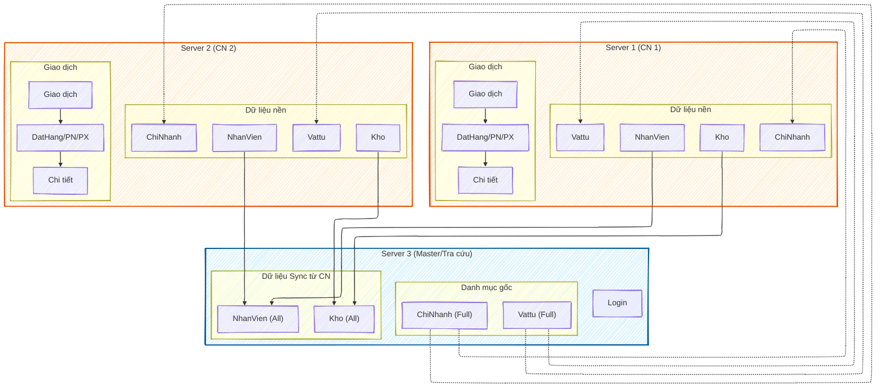

```mermaid
---
config:
  theme: base
  look: handDrawn
  layout: elk
---
flowchart TD
%% --- NODE GỐC: CTY ---
    subgraph Node_CTY ["🏢 CTY (TRUNG TÂM)"]
        direction TB
        CTY_Master[("MASTER DATA<br/>(ChiNhanh, Vattu)")]
        CTY_Agg[("SYNC DATA<br/>(NhanVien, Kho)")]
        CTY_Login["👤 Hệ thống Login"]
    end

%% --- NHÁNH 1: CN1 ---
    subgraph Node_CN1 ["🏭 CN1 (CHI NHÁNH 1)"]
        direction TB
    %% Data tại CN1
        subgraph CN1_DB ["Kho Dữ Liệu CN1"]
            direction LR
            CN1_Rep[("Replica<br/>(CN, VT)")]
            CN1_Local[("Local<br/>(NV, Kho)")]
        end

    %% Nghiệp vụ CN1
        subgraph CN1_Biz ["Nghiệp Vụ"]
            direction TB
            CN1_Trans["Giao Dịch<br/>(DatHang, PhieuNhap, PhieuXuat)"]
            CN1_Detail["Chi Tiết<br/>(CTDDH, CTPN, CTPX)"]
        end

        CN1_Trans --> CN1_Detail
    end

%% --- NHÁNH 2: CN2 ---
    subgraph Node_CN2 ["🏭 CN2 (CHI NHÁNH 2)"]
        direction TB
    %% Data tại CN2
        subgraph CN2_DB ["Kho Dữ Liệu CN2"]
            direction LR
            CN2_Rep[("Replica<br/>(CN, VT)")]
            CN2_Local[("Local<br/>(NV, Kho)")]
        end

    %% Nghiệp vụ CN2
        subgraph CN2_Biz ["Nghiệp Vụ"]
            direction TB
            CN2_Trans["Giao Dịch<br/>(DatHang, PhieuNhap, PhieuXuat)"]
            CN2_Detail["Chi Tiết<br/>(CTDDH, CTPN, CTPX)"]
        end

        CN2_Trans --> CN2_Detail
    end

%% --- CÁC LUỒNG DỮ LIỆU (TRỤC CÂY) ---

%% 1. Replication: Đẩy từ CTY xuống CN
    CTY_Master ==>|Replication| CN1_Rep
    CTY_Master ==>|Replication| CN2_Rep

%% 2. Sync: Đẩy từ CN lên CTY
    CN1_Local -.->|Đồng bộ về| CTY_Agg
    CN2_Local -.->|Đồng bộ về| CTY_Agg

%% --- Style màu sắc phân cấp ---
    classDef ctyStyle fill:#e3f2fd,stroke:#1565c0,stroke-width:3px,color:#0d47a1;
    classDef cnStyle fill:#fff3e0,stroke:#ef6c00,stroke-width:2px,color:#e65100;
    classDef dbStyle fill:#ffffff,stroke:#b0bec5,stroke-dasharray: 5 5;

    class Node_CTY ctyStyle;
    class Node_CN1,Node_CN2 cnStyle;
    class CTY_Master,CTY_Agg,CN1_Rep,CN1_Local,CN2_Rep,CN2_Local dbStyle;
```

